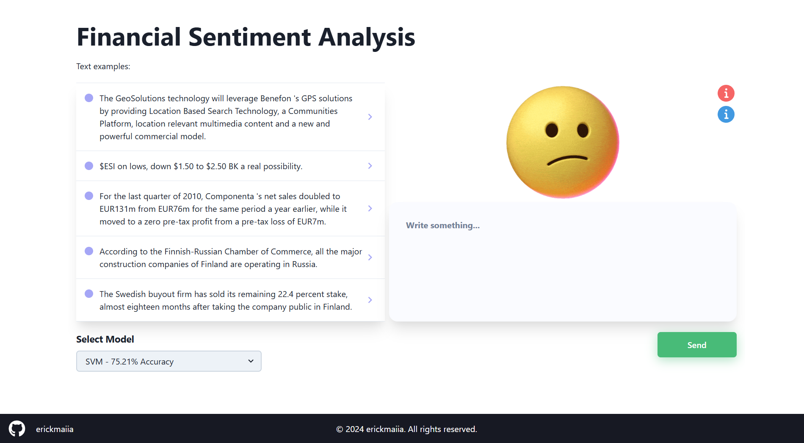

# Sentiment analysis API with FastAPI and a neural network model

This is an API built with [FastAPI](https://fastapi.tiangolo.com/) that utilizes an neural networks model for sentiment analysis on texts. The API receives a text via POST method and returns the sentiment associated with that text.

# About the models

Access this [repository](https://github.com/erickmaiia/financial-sentiment-analysis-ml)

## Routes

### Text Processing

#### `POST /predict_text`

This route receives a JSON object containing the text to be processed and returns the sentiment associated with that text.

#### Parameters

- `text` (string): The text to be analyzed.
- `model` (string): The model that will be used

#### Request Example

```json
{
  "text": "$ESI on lows, down $1.50 to $2.50 BK a real possibility."
  "model": "SVM"
}
```

#### Response Example

```json
{
  "sentiment": "negative"
}
```

#### `POST /predict_text_all_models`

This route receives a JSON object containing the text to be processed and returns all sentiment associated with that text across all models.

#### Parameters

- `text` (string): The text to be analyzed.
- `model` (string): The model that will be used

#### Request Example

```json
{
  "text": "$ESI on lows, down $1.50 to $2.50 BK a real possibility."
  "model": "All"
}
```

#### Response Example

```json
{
    "prediction": {
        "Naive Bayes": {
            "sentiment": "neutral",
            "inference_time_ms": 1.39,
            "confidence": 58.39391454926953
        },
        "SVM": {
            "sentiment": "positive",
            "inference_time_ms": 2.58,
            "confidence": null
        },
        "XGBoost": {
            "sentiment": "neutral",
            "inference_time_ms": 10.35,
            "confidence": 55.5428581237793
        },
        "LightGBM": {
            "sentiment": "positive",
            "inference_time_ms": 5.57,
            "confidence": 54.753866556500896
        },
        "Multilayer Perceptron": {
            "sentiment": "positive",
            "inference_time_ms": 1.05,
            "confidence": 99.79286726748342
        },
        "Gradient Boosting": {
            "sentiment": "neutral",
            "inference_time_ms": 71.19,
            "confidence": 65.40153464625972
        },
        "Random Forest": {
            "sentiment": "neutral",
            "inference_time_ms": 4.67,
            "confidence": 72.0
        },
        "AdaBoost": {
            "sentiment": "neutral",
            "inference_time_ms": 94.48,
            "confidence": 34.21799931861368
        },
        "Decision Tree": {
            "sentiment": "positive",
            "inference_time_ms": 0.17,
            "confidence": 100.0
        },
        "sentiment_distribution": {
            "positive": 4,
            "neutral": 5,
            "negative": 0
        }
    }
}
```

## Production API

The API is hosted on the GCP. You can access it at https://rest-api-reply-model-v1.onrender.com/.

You can visually access [here](https://interface-reply-model.vercel.app/) or click in the image.

[](https://interface-reply-model.vercel.app/)
