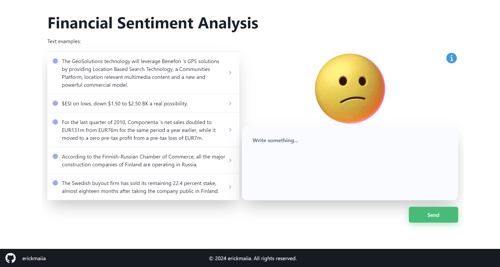

# Sentiment analysis API with FastAPI and a neural network model

This is an API built with [FastAPI](https://fastapi.tiangolo.com/) that utilizes an neural networks model for sentiment analysis on texts. The API receives a text via POST method and returns the sentiment associated with that text.

# About model

Access this [repository](https://github.com/erickmaiia/financial_sentiment_analysis_model)

## Routes

### Text Processing

#### `POST /process_text/`

This route receives a JSON object containing the text to be processed and returns the sentiment associated with that text.

#### Parameters

- `text` (string): The text to be analyzed.

#### Request Example

```json
{
  "text": "$ESI on lows, down $1.50 to $2.50 BK a real possibility."
}
```

#### Response Example

```json
{
  "sentiment": "negative"
}
```

## How to Use

1. Clone this repository:

```bash
git clone https://github.com/erickmaiia/rest-api-reply-model-v1.git
```

2. Install dependencies:

```bash
pip install -r requirements.txt
```

3. Download the model [here](https://drive.google.com/file/d/1jR_cnpLoxHq9Pue95F0C5c1QI-XKM31A/view?usp=sharing) and place it in the models directory

4. Run the server:

```bash
uvicorn main:app --reload
```

5. Make a GET request to http://localhost:8000/ to return an API welcome

## Production API

The API is hosted on the GCP. You can access it at https://rest-api-dus2eb35vq-uc.a.run.app/process_text/.

You can visually access [here](https://interface-reply-model.vercel.app/) or click in the image.

[](https://interface-reply-model.vercel.app/)
